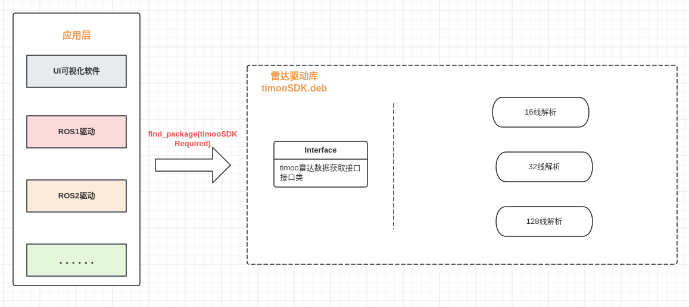

# TimooLidarDriverSDK 天眸雷达驱动SDK




## 1，编译依赖库
``` bash
sudo apt install libpcap-dev
```

## 2,编译打包
```shell
cd TimooLidarDriverSDK
mkdir build && cd build
cmake -DCMAKE_INSTALL_PREFIX=/opt/timoo_lidar_driver .. 
make
make package
sudo dpkg -i package/{xxx.deb}
```

## 3,使用
```shell
export CMAKE_PREFIX_PATH=$CMAKE_PREFIX_PATH:/opt/timoo_lidar_driver  # 也可以写入~/.bashrc中
```

```cmake
# CMakeLists.txt
find_package(TimooLidarDriverSDK REQUIRED)
include_directories(${TimooLidarDriverSDK_INCLUDE_DIRS})
link_libraries(${TimooLidarDriverSDK_LIBRARIES})
```
